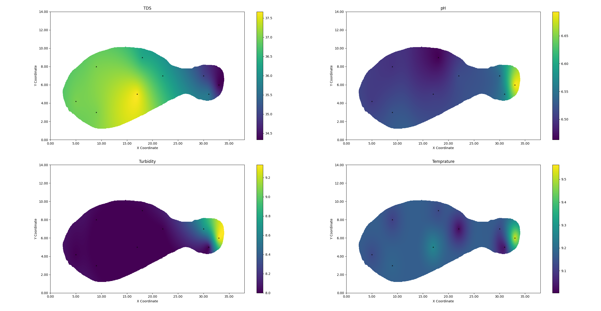
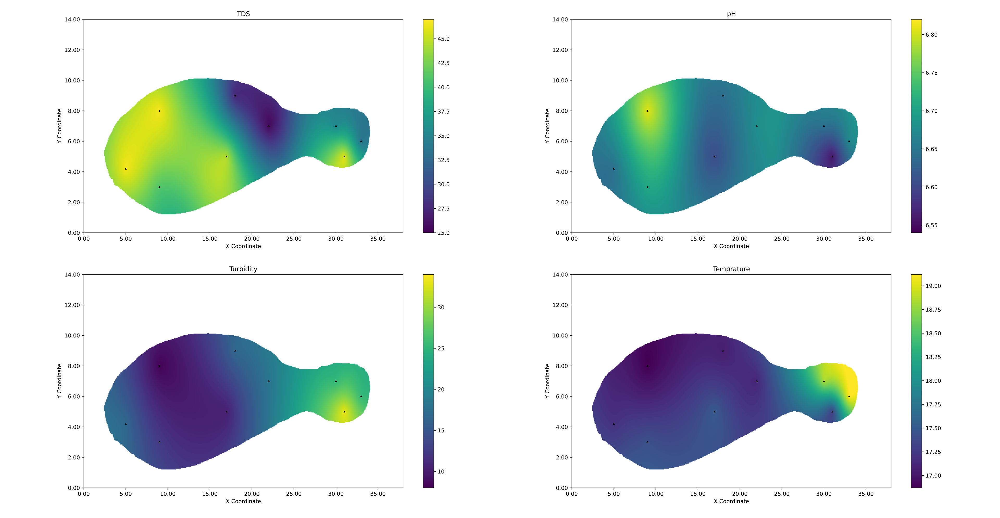

## The datasets include:

## 1. Water quality parameters (pH, TDS, Turbidity, and Temperature) at nine locations throughout a stationary pond at USC.
## 2. Kriging Data.
## 3. USGS data on the testing day.

## Datasets:

# 1. 11/9/2023.

Figure 1: Data Across The Pond on 11/9/2023.

# 2. 12/21/2023.

Figure 2: Data Across The Pond on 12/21/2023.

