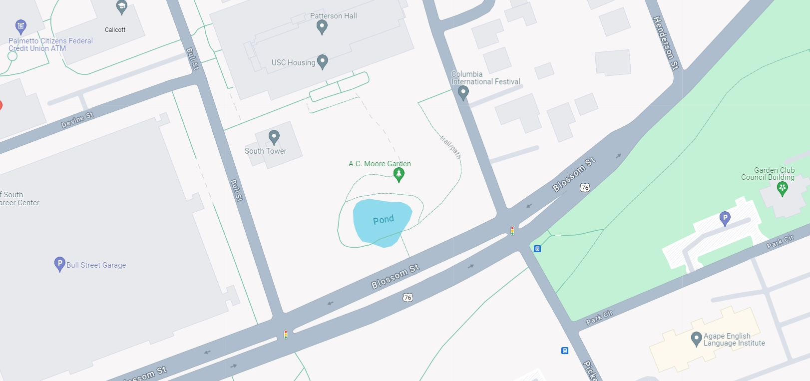
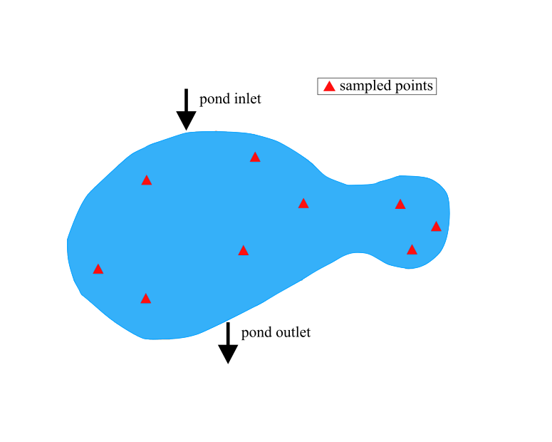
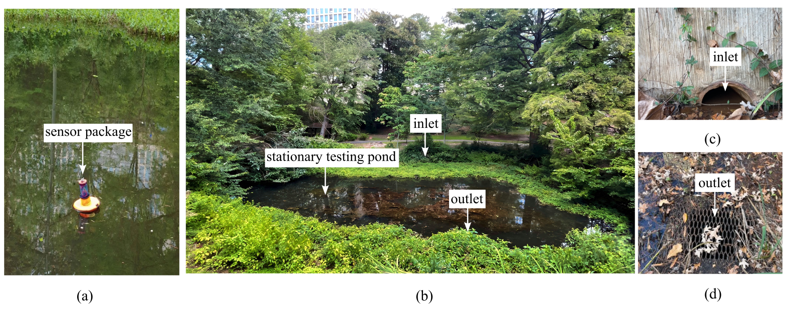

# USC-Spatial-Temporal-Pond-Data
Data set for the spatial and temporal monitoring of a pond at USC.

Figure 1: Pond at USC.

Figure 2: Sampling points across The pond at USC.

Figure 3: The monitored USC pond, showing: (a) the sensor package collecting data, (b) the pond at USC, (c) the inlet of the pond, (d) the pond’s outlet.

## Licensing and Citation

This work is licensed under a Creative Commons Attribution-ShareAlike 4.0 International License [cc-by-sa 4.0].

Cite this as: 

@Misc{ARTSLabUscSpatialTemporal,    
  author = {ARTS-Lab},  
  howpublished = {GitHub},  
  title  = {{USC}-Spatial-Temporal-Pond-Data},  
  groups = {ARTS-Lab},    
  url    = {https://https://github.com/ARTS-Laboratory/USC-Spatial-Temporal-Pond-Data},   
}

